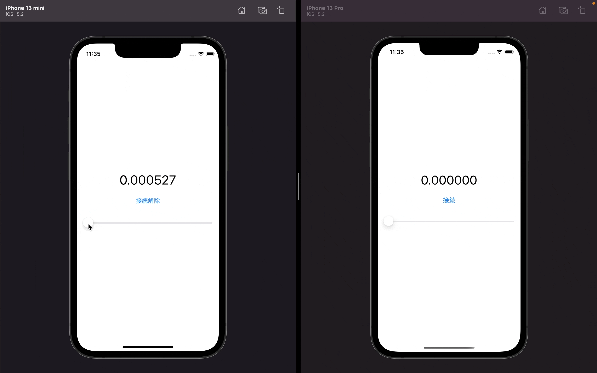

# Socket.IOを使ってリアルタイムアプリケーションを作ろう！

# スライダーアプリ

ある端末でスライダーを引っ張ると他の端末のスライダーにも値が反映されます

## 使い方（mainブランチ）

### 推奨環境

- Mac OS
- Xcode (version 13)
- Node (version 16)
- Socket.IO (version 4)

### 手順

#### バックエンド側
1. `./server`ディレクトリに移動する
2. 初めて使う場合は`npm install`をコマンドラインから実行する
3. `node index.js`をコマンドラインから実行する

#### iOSアプリ側
1. Xcodeで`RealtimeApplication.xcodeporj`ファイルを開く
2. Packageがインストールされるのも待ってからシミュレータを実行する
