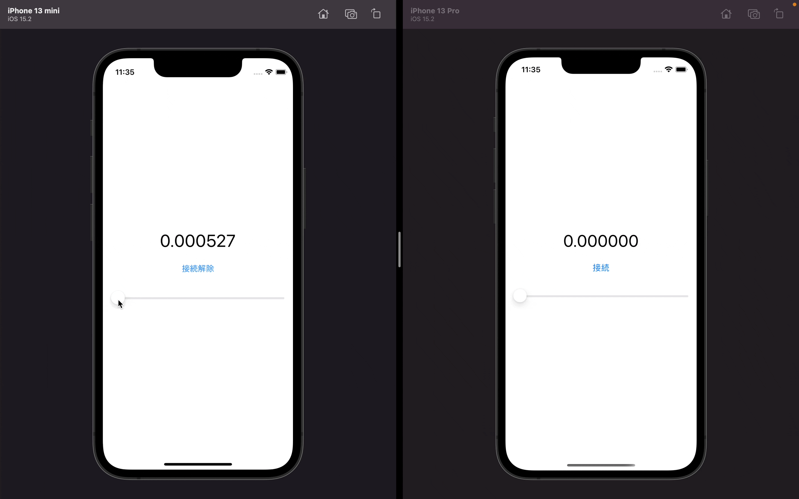

# 03

「【SocketIO】リアルタイムなアプリケーションを作ろう」の[3 回目の動画]()です。

| :technologist: | :rocket: |
| -------------- | -------- |
| 作成者         | ふみっく |

## 今回のゴール

アプリ側で Slider が変更されると、Socket.IO を通じて他の端末のアプリでも Slider が更新されることを確認しましょう。

| 完成イメージ              |
| ------------------------- |
|  |

**注意: アプリ側の実装は自前で用意していください。サーバーの動作が確認できる iOS アプリを同リポジトリに用意しているので Mac OS の方はお使いください。**

- [iOS アプリ](../iOSRealtimeApplication/)
