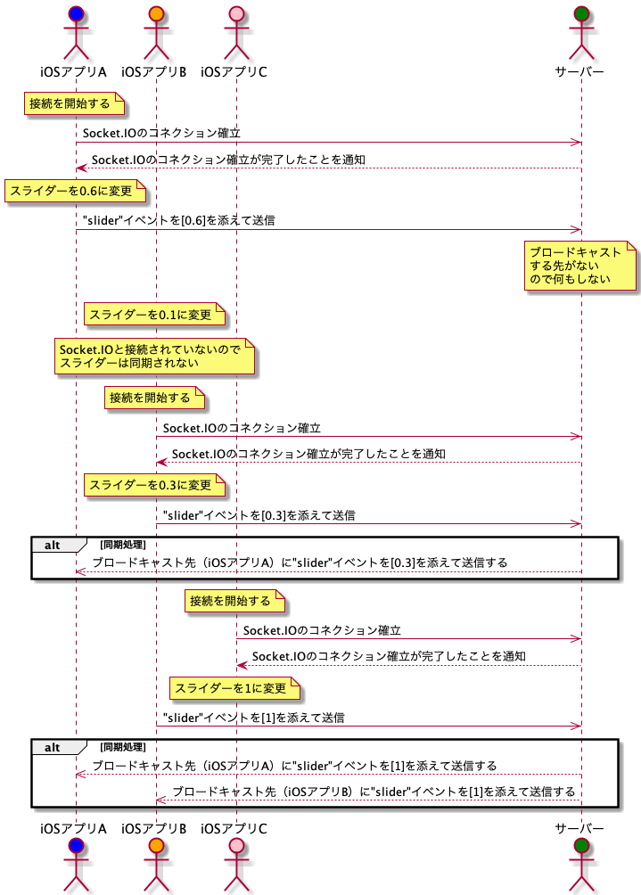

## 03

「【SocketIO】リアルタイムなアプリケーションを作ろう」の[3 回目の動画]()です。

| :technologist: | :rocket: |
| -------------- | -------- |
| 作成者         | fummicc1 |

### 今回のゴール

アプリ側で Slider が変更されると、Socket.IO を通じて他の端末のアプリでも Slider が更新されることを確認しましょう。

| 完成イメージ              |
| ------------------------- |
|  |

**注意: アプリ側の実装は自前で用意していください。サーバーの動作が確認できる iOS アプリを同リポジトリに用意しているので Mac OS の方はお使いください。**

- [iOS アプリ](../iOSRealtimeApplication/)

### 前提知識

- `Node` `npm` `express`

### シーケンス図

厳密さにかけますが、図もあった方が伝わりやすいと思いシーケンス図を作成しました。

iOS アプリ A, B, C それぞれのスライダーの値は Socket.IO に接続されていれば同期できるようになります。今回は`slider`という名前のイベントでスライダーの値をサーバーと送受信していきます。
